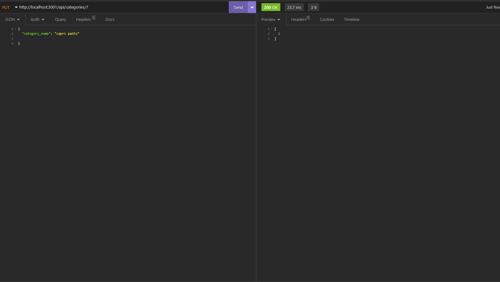

# e-commerce

## Table of Contents 

- [Description](#description)
- [Usage](#usage)
- [Contributors](#contributors)
- [License](#license)
- [Questions](#questions)

## Description
A back-end for an e-commerce website that uses the latest technologies to compete with other e-commerce companies. This application configures a working Express.js API to use Sequelize to interact with a MySQL database

## Usage
    

[Watch video here for tutorial](https://drive.google.com/file/d/1PPjDhg74q1zZhdVyYR1ZQ1IHVMu6FrTd/view)

## Contributors
Brenn Voyles

## License
[MIT License](https://spdx.org/licenses/MIT.html)

Permission is hereby granted, free of charge, to any person obtaining a copy
of this software and associated documentation files (the "Software"), to deal
in the Software without restriction, including without limitation the rights
to use, copy, modify, merge, publish, distribute, sublicense, and/or sell
copies of the Software, and to permit persons to whom the Software is
furnished to do so.

## Questions 
If there are any additional questions, feel free to reach out by email or github.

Email: [brennaveir@hotmail.com](mailto:brennaveir@hotmail.com)

Github: [brennaveir](https://github.com/brennaveir)

